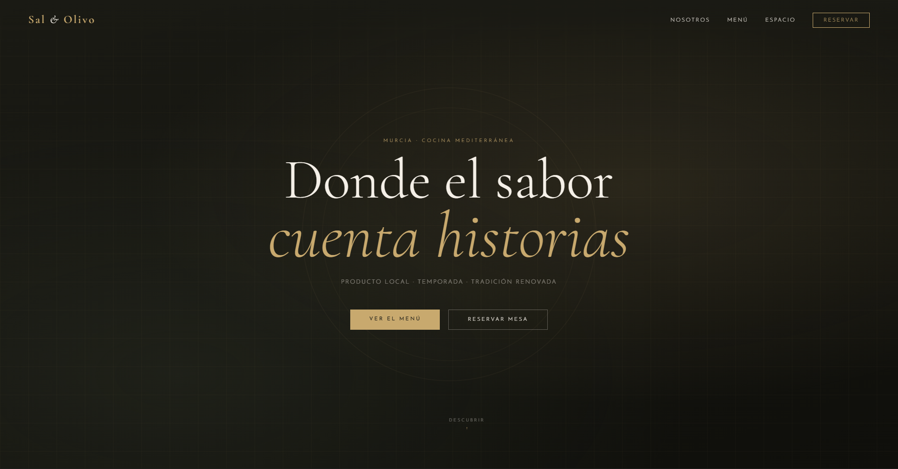

# Restaurant Landing Page

A modern and responsive restaurant landing page built with HTML, CSS, and JavaScript.

## Features

* Responsive design for desktop, tablet, and mobile devices
* Modern and clean user interface
* Interactive navigation menu
* Smooth scrolling experience
* Attractive sections for menu, services, and contact information
* Fast and lightweight implementation

## Technologies Used

* HTML5
* CSS3
* JavaScript

## Preview

This project showcases a professional restaurant website designed to attract customers and provide an excellent user experience.

## Project Structure

```text
index.html
style.css
script.js
```

## Author

Said Boushaba

GitHub: https://github.com/S-Umbra
## Screenshot


